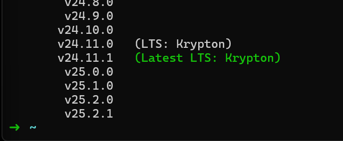
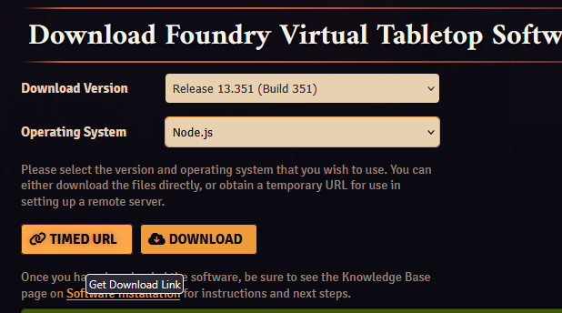

Last updated: 2025/12/05

---

### Info

#### What will I have at the end of this tutorial?

You will have a Foundry server running on a remote system that will always be on. You'll have secure HTTPS for your connection. It will be a very basic setup. Your certificate will optionally be self-signed and probably scary looking the first time you connect, but perfectly good to use for years (Step 8a). Alternatively, if you have a domain, we can set up a proper HTTPS site that will get rid of the self signing warning (Step 8b).

#### What do you need, before we begin?

- Between $4 and $6 per month
- A FoundryVTT licence
- A terminal (PowerShell on Windows, Terminal on macOS/Linux)
- If you want the fancier setup, a web domain like `yourdomain.com` - not required.

---

### Step one - Open your terminal

**Windows:** Hit the Windows key and search for `PowerShell`. Run it.
**macOS:** Hit Command + Space and search for `Terminal`. Run it.

Nice and easy :)

---

### Step two - generate ssh keys

We need to generate a key pair to securely access the server.

In your terminal, type:

    $ ssh-keygen -t ed25519


Use the default options for everything, and no password.

That generated two files. `id_ed25519` and `id_ed25519.pub`

It tells you their output location. They are either in your drive's main `.ssh` folder, or your user's `.ssh` folder. If you so wish you can go and rename them something like `foundryserverkey` and `foundryserverkey.pub`. I will just keep calling them by their default names here.

Nice job so far! :)

---

### Step three - get a server

You’re going to buy a Virtual Private Server (VPS). This is a virtual machine with some bells and whistles that lives remotely in a datacenter.

For this guide I’m going to show you how to do it with a low effort DigitalOcean droplet, a type of VPS. Personally I use a Hetzner server, as they are cheaper and offer a bit more. The downside is that for some countries / types of server they require a scan of an ID before they allow you to start renting a server.

If you want to go the Hetzner route to save some money, the entire guide still applies aside from the details around the DigitalOcean UI. Hetzner UI has close equivalents ofc.

Sign up and buy a basic droplet from DigitalOcean here:
https://www.digitalocean.com/products/droplets/

Once your payment is completed, you’ll find yourself on the https://cloud.digitalocean.com dashboard.

Back on the DigitalOcean dashboard, on the left under **Manage**, click `Droplets` and `Create new droplet`.

You may want to change your server’s location closer to home.

Under **Authentication** you want to select `SSH Keys`. Choose `New SSH Key`.

Open the `id_ed25519.pub` file in notepad and copy the contents, it looks like `ssh-ed25519 AAAAC3Nza[...]`.

Paste the key you copied into the `SSH Key Content` box. Give it a name, like `fvtt` or something, and click `Add SSH Key`.

Under `Choose a hostname`, just call it whatever you like. I’ll call mine `FVTT`.

Now at the bottom, you can hit `Create Droplet` :)

You’ll be brought to a new page, where a progress bar will show you your new VPS spinning up! Woo!

Once it’s ready to go, copy the IP address (format of `x.x.x.x`).

---

### Step four - login to your VPS

Go back to your terminal window (PowerShell or Terminal).

Type the following, replacing `x.x.x.x` with the IP address you just copied:

    $ ssh root@x.x.x.x

You’ll get some message that the host key isn’t cached. That is fine, type `yes` or `y` and hit enter. Happens on first connect.

Once we hit enter, we’ll find ourselves logged in!

---

### Step five - create yourself a user on the server

Lines that start with a `$` are commands. Enter them **without** the `$` or leading space. This is true for the rest of the guide. If you see `$ lol` you should type `lol` into the terminal and press `enter` :)

You can paste into the terminal window with just a right click.

Add a user. I’m `foundryuser`, so I’ll add myself:

    $ adduser foundryuser

You’ll be prompted to enter a password and a bunch of rubbish info. Add a password and just spam `enter` through the junk.

Now we give this user a way to do admin things - aka `sudo`:

    $ usermod -aG sudo foundryuser

If you have an issue with rsync run

    $ sudo apt install rsync

Now we need to set it such that our new user can log in to the server:

    $ rsync --archive --chown=foundryuser:foundryuser ~/.ssh /home/foundryuser

(Being careful to replace `foundryuser` with your username.)

Now log out (type `exit`), and log back in, using your new username instead of `root`.

    $ ssh foundryuser@x.x.x.x

Test this user is working with this command, entering this new user’s password when prompted:

    $ sudo ls -la /root

If you see some random files listed, nice!

Update the server:

    $ sudo apt update
    $ sudo apt upgrade -y

Accept the default on anything that pops up.

If you have any issues, relog as `root` and make sure you didn’t miss a step.

---

### Step six - set up stuff Foundry needs

I’m going to deviate a little from the actual Foundry guide, as I find this more repeatable, simpler, and with a much better troubleshooting story.

Install `nvm`. Foundry runs on `node`, a type of JavaScript. We’re going to install the Node Version Manager to handle all of the Node stuff for us.

Go here and get the correct install URL:
https://github.com/nvm-sh/nvm#installing-and-updating

It will look like this:

    $ curl -o- https://raw.githubusercontent.com/nvm-sh/nvm/v0.39.7/install.sh | bash

Then:

    $ source ~/.bashrc

Ensure `nvm` is installed:

    $ command -v nvm

…should output `nvm`.

Install a modern version of Node. Generally you want to install the latest Long Term Support (LTS) release. Run this command to get a list of available node versions:

    $ nvm ls-remote

You will be presented with a list of versions. Go for the latest LTS release. In my EXAMPLE screenshot (which may be out of date!) that version is `24.11.1`

    $ nvm install 24.11.1




Ensure node is installed:

    $ node --version

…will output the version.

---

#### Step seven - create directories for Foundry, and install it

    $ cd ~ && mkdir foundryvtt && mkdir foundrydata && cd foundryvtt

Now, log in to the Foundry site, go to your user profile -> purchased licences. Select the latest stable release from the dropdown, and the "node.js" version for "operating system".



Then use the "TIMED URL" download link copy button.

Back in the terminal:

**Replace the `PASTE_IN_HERE` portion with your copied link, leaving in the quotes `'`!**

    $ curl -o foundryvtt.zip 'PASTE_IN_HERE'

It will look like:

    $ curl -o foundryvtt.zip 'https://r2.foundryvtt.com/releases/13.351/FoundryVTT-Node-13.351.zip?verify=1764763601-oudNyhbcXSfJoCL%2BkWtdRPJ2Wdx9fRG9429%2B%2FPAaIR4%3D'

Then unzip:

    $ unzip foundryvtt.zip

If you get an error that you do not have unzip, run

    $ sudo apt install unzip

and try unzip again :)

---

### Step eight - check Foundry is working

Replace username and run:

*WARNING! DO NOT ENTER YOUR LICENSE KEY YET*

    $ node ~/foundryvtt/main.js --dataPath=$HOME/foundrydata

You should see Foundry start up :D

Now you can open a browser and go take a look. In the address bar, paste the server’s IP and set the port to 30000, like:

    178.62.98.216:30000

Kill Foundry with `ctrl+c` in the terminal window once you’re happy it’s working so far.

---

### Step nine - enable https

If you want to ensure your license key is secure when you activate Foundry, and you want to ensure the traffic of your players and yourself are secure from prying eyes (which you should), you’ll want to enable HTTPS.

This means we’re going to generate some more keys! Yaaaaaaaay.

This is where the guide takes two paths - choose your own adventure.

**Options:**
* **Option A:** You don't have a domain name. Use a self-signed cert. It's free, easy, but gives a browser warning.
* **Option B:** You own or are going right now to buy a domain name (like `yourdomain.com`). Use Let's Encrypt. It's free, slightly more setup, and gives a proper https connection. We are going to set this version up behind a dedicated webserver for a more complete "best practice" path.

### Option nine(a): Self-Signed (No Domain)

Install `openssl`:

    $ sudo apt install openssl

Set up the directory structure:

    $ cd ~ && mkdir foundrycerts && cd foundrycerts

Generate cert/key:

    $ openssl req -x509 -newkey rsa:4096 -keyout key.pem -out cert.pem -days 99999 -nodes

Spam `enter` to skip junk questions.

Now we need to tell Foundry where these files are. Skip down to "Configuring Foundry" below.

### VIM WARNING!!! A quick lesson in vim, the text editor you'll need next!
The next section "Configuring Foundry" has tips for using vim around a direct example. If you are going to use option nine(b) for high tech HTTPS and you don't know how to use vim, look ahead at the example. If you are going straight to that section, Go right ahead, and take your time :)

### Option nine(b): Let's Encrypt (Requires Domain, more complex)

This option gives you proper HTTPS, no browser warnings, and auto-renewing certificates.

First, go to your domain registrar (where you bought your domain) and create a **DNS A Record**.
* **Host:** `@` or leave blank (or a subdomain like `foundry`)
* **Value:** Your server's IP address (`x.x.x.x`)

I recommend a subdomain. If you type "foundry" in `host` your url will ultimately be like `foundry.yourdomain.com` which is nice.

Wait a few minutes for this DNS change to update. It should have a little pending warning or whatever on the record page.

Back in your terminal, install certbot, nginx (a webserver) and some helper scripts:

    $ sudo apt install nginx certbot python3-certbot-nginx

Once these are installed, we'll create a config in the server so it knows about foundry:

    $ sudo vim /etc/nginx/sites-available/foundry

This opens vim - please read the "VIM WARNING" if you have not, and you aren't familiar with vim!

Paste this in to vim (typically right click pastes in terminals):

```nginx
    server {
        listen 80;
        listen [::]:80;

        server_name yourdomain.com;  # or foundry.yourdomain.com

        location / {
            proxy_pass http://localhost:30000/;
            proxy_http_version 1.1;

            proxy_set_header Upgrade $http_upgrade;
            proxy_set_header Connection "Upgrade";
            proxy_set_header Host $host;
            proxy_set_header X-Forwarded-Proto $scheme;
            proxy_set_header X-Forwarded-For $proxy_add_x_forwarded_for;
        }
    }
```

Save and exit `esc` -> `:wq`

Enable the site config


    $ sudo ln -s /etc/nginx/sites-available/foundry /etc/nginx/sites-enabled/
    $ sudo nginx -t
    $ sudo systemctl restart nginx


Generate the certificate (replace `yourdomain.com` with your actual domain. If you set your A record earlier to be a subdomain like `foundry.yourdomain.com` be sure to use that full domain.):

    $ sudo certbot --nginx -d yourdomain.com

### Configuring Foundry (For both nine(a) and nine(b))

This bit is a little tricky. We’re going to use `vim` to edit the config file, so Foundry knows where to find our cert file.

`vim` is an old-school editor, and tricky for noobs. If you follow the keystrokes I lay out *exactly* you won’t have a problem. If at any point you do have a problem, press `esc` followed by `:` followed by `q!` and press enter to exit, and just start again. `esc` enters command mode and `:q!` is the command that means "quit without caring if it's not saved".

    $ vim ~/foundrydata/Config/options.json

Once `vim` is open, press `i`. You will see at the bottom it says `-- INSERT --`. This is good. If it does not, you did not press `i`.

Replace `foundryuser` as per usual.

Use the arrow keys to navigate.

If you are self signing, make these changes:

    "sslCert": "/home/foundryuser/foundrycerts/cert.pem",
    "sslKey": "/home/foundryuser/foundrycerts/key.pem",

If you are using a domain and let's encrypt, only set:

    "proxySSL": true,

leaving the other ssl fields as they are.

Now press `esc` then `:` then type `wq` and hit enter.

You can verify everything worked by running Foundry again with:

    $ node ~/foundryvtt/main.js --dataPath=$HOME/foundrydata

If you self signed you should now see both the cert and key have paths in the startup text of Foundry.

Let's encrypt doesn't need certs there.

Kill Foundry again with `ctrl+c`.

---

### Step ten - create a service to run Foundry for you

When you close your server connection, processes you have running close too. We want to create a service to keep Foundry running even when we close our connection to the server.

Get your Node version and make a note of it. You’ll need it in a second:

    $ node --version

First we’re going to use `vim` to create a service file:

    $ sudo vim /etc/systemd/system/foundry.service

Press `i` again to go into `INSERT` mode and type the following (you can try pasting it in but `vim` is kind of weird like that):

Of course, again replace `foundryuser` with your username in all four locations. Also, replace your Node version. Below, mine is `v24.x.x` in the `ExecStart` line.

```systemd
    [Unit]
    Description=FoundryVTT
    After=network.target
    StartLimitIntervalSec=0

    [Service]
    Type=simple
    Restart=always
    RestartSec=1
    User=foundryuser
    WorkingDirectory=/home/foundryuser/foundryvtt
    ExecStart=/home/foundryuser/.nvm/versions/node/v24.x.x/bin/node main.js --dataPath=/home/foundryuser/foundrydata

    [Install]
    WantedBy=multi-user.target
```

Exit `vim` as before: `esc`, `:`, `wq`, `enter`.

Now start the service:

    $ sudo systemctl start foundry.service

Check it’s up and running. Press `q` to exit the status:

    $ sudo systemctl status foundry.service

Finally, enable the service so it auto starts any time the server is rebooted:

    $ sudo systemctl enable foundry.service

aaaaaaaaaaaaaaaaaaaaaand that’s it! Congrats on making it through!

---

### Step eleven - using the server

You are ready to adventure!

**Important!**

**If you used Option nine(a) (Self-Signed):**
You’re going to get a weird looking warning the first time you connect. This is because your server is issuing your browser with its own self-signed certificate (the one you made for it). Just go to advanced and accept it and continue. We’re not really interested in if it is authentic, because you know it is, you just made it.

To connect to your server, go to the following address (replace `0.0.0.0` with your server's IP address):

    https://0.0.0.0:30000

**If you used Option nine(b) (Let's Encrypt):**
You can navigate directly to your domain. No warnings! And no need to use a port number.

    https://yourdomain.com

---

Now you can enter your licence key and start using your server. I recommend using cyberduck as an ftp (remote file) gui. You can reuse the keys you generated for your ssh connection in there. It makes it so you can drag and drop files between the server and your computer.

https://cyberduck.io/


Like this guide? It cost me five dollaz and a bunch of time I should have been working to make! Feel free to tip at:

- https://paypal.me/theelous3
- https://ko-fi.com/theelous3
