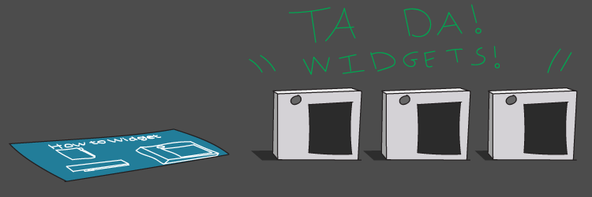

Let's say you wanted to design a useful little machine called a widget, and start producing them in a range of colours. First thing you'd do is design a blueprint. In Python, writing a class is much like writing a blueprint for something. Let's write our widget!

```python
class Widget:
    pass
```

Well. That was easy. We could start producing these widgets right away if we liked.

```python
first_edition_widget = Widget()
second_edition_widget = Widget()
third_edition_widget = Widget()
```



Nice! We have our widgets. Each widget is an instance of `Widget` and is its own object. We don't yet have a way to give our widgets a range of colours though. Giving our class an `__init__` method will enable us to initialise each widget with a colour. Let's do that, and then create a red widget.

```python
class Widget:

    def __init__(self, colour):
        self.colour = colour

red_widget = Widget('red')
```

So, generally speaking, if you're reading this you should know that our `red_widget` now has a `.colour` attribute which can be accessed by `red_widget.colour`. But what is *self*? What is an *instance*? How is the `red_widget` instance different from the `Widget` class definition?

How about we add a `what_colour` method that allows widgets to tell us their colour, to illustrate what `self` means.

```python
class Widget:

    def __init__(self, colour):
        self.colour = colour

    def what_colour(self):
        print(f"I'm a {self.colour} widget :)")

>>> red_widget = Widget('red')
>>> blue_widget = Widget('blue')

>>> red_widget.what_colour()
"I'm a red widget :)"
>>> blue_widget.what_colour()
"I'm a blue widget :)"
```


Here we can see that an instance of a widget is able to refer to parts of its self, using self. When a widget looks up `self.colour` it looks up **its own individual colour**. We can see the blue widget is aware it is blue, and the red aware it is red. These are completely independent objects with their own ideas of self.

Just like I can say *“This is my coffee”*, our widgets can say *“This is my colour”* — by means of the idea of `self`. This is true for all instances of any class.

___
**self refers to the instance from which self is being used.**
___

What is the `self` in the method signature here though: `def what_colour(self):`

This, more than anything, is a formality — a language design choice. A method needs to know which instance of a class it's dealing with, and passing the actual instance to it is the most explicit way of doing this. Python will automatically pass self for us, but not receive it for us. This allows us to have things like `@staticmethod` which you can read about yourself.

To reiterate: why do we do:

```python
red_widget.what_colour()
```

rather than

```python
red_widget.what_colour(red_widget)
```

if the method needs to know what instance it's working with?

Well — we *could* do the latter if we wanted! We can demonstrate how `self` is the exact same as `red_widget` in the following example:

```python
class Widget:

    def __init__(self, colour):
        self.colour = colour

    def what_colour(self, pretend_self):
        print(f"I'm a {pretend_self.colour} widget :)")

>>> red_widget = Widget('red')
>>> red_widget.what_colour(red_widget)
"I'm a red widget :)"
```

This time, we never used `self` at all! `self` was passed as the first argument to `.what_colour` by Python, and then we passed our instance of the red widget to its `self`, and used that in place of the automatically passed one. There was absolutely **no difference in terms of functionality** from the last time we ran `.what_colour` normally.

If you're very clever, having been told that an instance's method needs to be passed its self as an instance, you're wondering **why can't it just *know*?**

Well, when you call a method on an instance, behind the scenes Python is really calling the instance’s **class’ method** and passing the instance.

Look at this:

```python
class Widget:

    def __init__(self, colour):
        self.colour = colour

    def what_colour(self):
        print(f"I'm a {self.colour} widget :)")

>>> red_widget = Widget('red')
>>> Widget.what_colour(red_widget)
"I'm a red widget :)"
```

^^ **That is why, when defining a class, the methods must accept an instance!**
